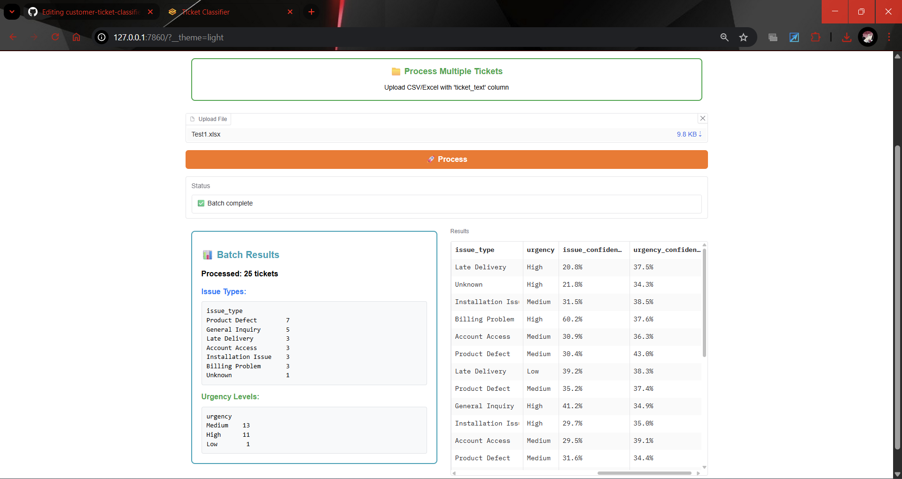

# Customer Support Ticket Classifier

Automated classification of customer support tickets by issue type and urgency, with key entity extraction. Features an interactive web interface.

## 📋 **Key Features:**
*   **Issue Classification:** Identifies 7 types (e.g., Billing, Product Defect).
*   **Urgency Prediction:** Low, Medium, High.
*   **Entity Extraction:** Products, dates, order numbers.
*   **Interactive UI:** Real-time & batch processing via Gradio.

---

## 🚀 **Quick Start**

**1. Prerequisites:**
*   Python 3.8+
*   Git

**2. Setup & Installation:**
```bash
# Clone or download the project, then navigate to its root directory
# cd path/to/ticket_classifier

# Create & activate virtual environment
python -m venv ticket_env
# Windows: ticket_env\Scripts\activate
# macOS/Linux: source ticket_env/bin/activate

# Install dependencies
pip install -r requirements.txt

# Download NLTK data
python -c "import nltk; nltk.download('punkt'); nltk.download('stopwords'); nltk.download('wordnet'); nltk.download('averaged_perceptron_tagger')"

# Place dataset: ai_dev_assignment_tickets_complex_1000.xlsx into data/
```

**3. Model Training (Choose one):**

*   **A) Jupyter Notebook (Recommended):**
    ```
    cd notebooks
    jupyter notebook
    ```
    Open `main_analysis.ipynb` and run all cells.

*   **B) Python Scripts:**
    ```
    cd src
    python data_preprocessing.py
    python feature_engineering.py
    python model_training.py
    ```
    *Models are saved to the `models/` directory.*

**4. Run Web Interface:**
```
cd src
python gradio_app.py
```
Access at: `http://localhost:7860`

---

## 🏗️ **Project Structure**
```text
ticket_classifier/
├── data/
│   └── ai_dev_assignment_tickets_complex_1000.xlsx
├── models/              # Saved models & objects
├── src/                 # Source code
│   ├── data_preprocessing.py
│   ├── feature_engineering.py
│   ├── model_training.py
│   ├── entity_extraction.py
│   ├── ticket_classifier.py # Main pipeline
│   └── gradio_app.py      # Web interface
├── notebooks/
│   └── main_analysis.ipynb  # Full analysis & training
├── requirements.txt
└── README.md
```
---

<h2>🌐 Web Interface (Gradio)</h2>

<p>The application provides an interactive web interface built with Gradio for easy interaction with the ticket classification system.</p>

<ul>
    <li>
        <p><strong>Home Page / About:</strong> Provides an overview of the application, its capabilities, and how to use the different features.</p>
        <p align="center">
            
        </p>
        <p align="center">
            
            <br/><em>(Describes features and usage)</em>
        </p>
    </li>
    <li>
        <p><strong>Single Ticket Prediction:</strong> Allows users to input a single ticket text for real-time classification and entity extraction. The results, including predicted issue type, urgency, extracted entities, and model confidence, are displayed directly on the interface.</p>
        <p align="center">
            
        </p>
    </li>
    <li>
        <p><strong>Batch Processing:</strong> Enables users to upload a CSV or Excel file containing multiple tickets.</p>
        <p align="center">
            
        </p>
        <p>The system processes each ticket and provides a downloadable file (typically CSV) containing the original ticket text along with the predictions and extracted entities for all tickets.</p>
        <p align="center">
            
            <br/><em>(Illustrates the structure of the output from batch processing)</em>
        </p>
    </li>
</ul>

---

## 🔧 **Core Technical Approach**

*   **Preprocessing (`data_preprocessing.py`):** Text normalization (lowercase, special char removal while preserving `!?.`), tokenization, lemmatization (NLTK), stopword removal, TextBlob sentiment analysis.
*   **Feature Engineering (`feature_engineering.py`):**
    *   **Text:** TF-IDF (2000 features, 1-2 n-grams), text length, word count, sentiment.
    *   **Engineered:** Counts of complaint/urgency/domain keywords, punctuation features (caps ratio, `?!` counts), length categories.
*   **Modeling (`model_training.py`):**
    *   Separate Random Forest classifiers for issue type and urgency.
    *   SMOTE for class imbalance, 5-fold stratified CV, hyperparameter tuning.
*   **Entity Extraction (`entity_extraction.py`):** Rule-based (regex) for products, dates, order numbers, complaint/urgency keywords.

---

## 🎯 **Key Design Choices**

*   **Traditional ML (Random Forest):** Chosen for interpretability, faster training, and good performance for this dataset size, avoiding deep learning complexity.
*   **Separate Models (Issue & Urgency):** Allows independent optimization and better feature relevance for each task.
*   **Rule-Based Entity Extraction:** High precision for structured data, interpretable, no extra training data needed.
*   **Hybrid Feature Engineering:** Combines TF-IDF's semantic capture with domain-specific engineered features.

---

## 📈 **Performance Summary**
*   **Issue Classification:** 60-80% accuracy (Random Forest).
*   **Urgency Classification:** 55-75% accuracy (Random Forest).
*   *(Detailed metrics in `notebooks/main_analysis.ipynb`)*

## ⚠️ **Limitations:**
*   Model performance capped by traditional ML and class imbalance.
*   Domain-specific; requires retraining for new contexts.
*   English only. Rule-based NER has limited flexibility.

## 🔮 **Future Improvements:**
*   **Short-Term:** Enhance regex, expand keywords,  and further tune.
*   **Long-Term:** Explore Deep Learning (BERT), advanced NER, active learning, multilingual support.

---

## 📝 **Dependencies**
Listed in `requirements.txt`. Key libraries: `pandas`, `scikit-learn`, `nltk`, `textblob`, `gradio`, `imbalanced-learn`.

---

## 🤝 **Contributing**
1.  Fork the repository.
2.  Create a feature branch (`git checkout -b feature/YourImprovement`).
3.  Commit your changes (`git commit -m 'Add some YourImprovement'`).
4.  Push to the branch (`git push origin feature/YourImprovement`).
5.  Open a Pull Request.

---

## 📄 License
This project was created for educational purposes as part of an assignment. Feel free to use, modify, and adapt the code for learning and development..

## 👨‍💻 Developer

Developed with ❤️ by [Priyanshu Kumar](https://github.com/SyntaxError-Natsu)

---

⭐ Star this repository if you found it helpful!


🙏 **Acknowledgments**
Thanks to NLTK, Scikit-learn, Gradio teams, and the assignment provider.
